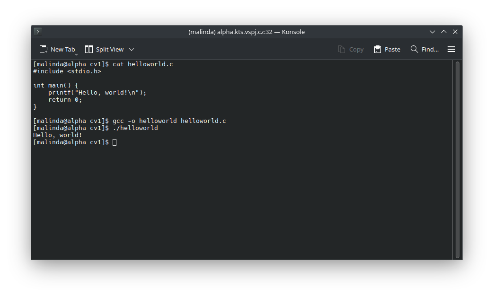
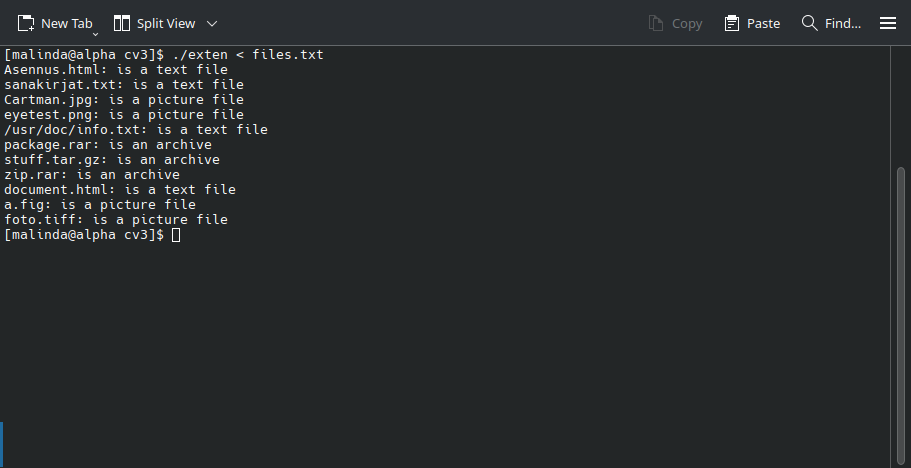

# xPJP

## Cvičení 1

## Cvičení 2

- egrep '\<[a-zA-Z][0-9]\>' test.txt
- egrep ^[a-zA-Z0-9]+$ test.txt
- egrep ^[a-z]{4}$ test.txt
- egrep '\b[a-zA-Z]+\b' test.txt
- egrep '^(ab|ba)[c-z0-9]\*?(ab|ba)$' test.txt
- egrep '\b[0-9]+\b' test.txt
- egrep '\/\*.\*\*\/' test.txt

## Cvičení 3

## Cvičení 4

## Cvičení 5

